<p align="center">
  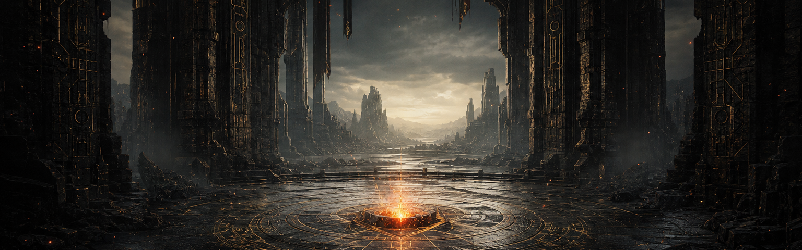
</p>

<h1 align="center">Augusto Almeida</h1>

<p align="center">
  <strong>Fullstack Developer · Quality Engineer · Applied AI</strong><br />
  <sub>São Paulo, Brazil — building dependable systems, one hard-earned level at a time.</sub>
</p>

<p align="center">
  <a href="https://www.linkedin.com/in/augustobalmeida/">
    
  </a>
  <a href="https://auggiealmeida.vercel.app/">
    
  </a>
  <a href="mailto:augustob.almeida12@gmail.com">
    
  </a>
</p>




I build fullstack products with a quality-first mindset: clear interfaces, reliable APIs, useful tests, observable failures, and software that remains maintainable after the first release.

Today I work as a **Fullstack Developer at Stech**. My path also includes teaching technology at **Cebrac** (until June 2026), test engineering and AI evaluation, frontend development, technical support, data, and product delivery — experience that helps me see a system beyond its happy path.

```text
CURRENT QUEST
├── Build end-to-end products with TypeScript, React, Node.js and Java
├── Strengthen delivery through automation, testing and observability
├── Apply AI to engineering without surrendering technical judgment
└── Share what I learn through teaching and documentation
```



<p><sub>RIGHT HAND · ARMAMENTS</sub><br /><strong>Systems</strong></p>


<p><sub>LEFT HAND · SHIELD</sub><br /><strong>Quality</strong></p>


<p><sub>ATTUNEMENT · CASTINGS</sub><br /><strong>Interfaces</strong></p>


<p><sub>ARMOR · EQUIPMENT</sub><br /><strong>Infrastructure</strong></p>



<a href="https://github.com/AuggieAlmeida/repo-explorer">
  
</a>
<p align="center">
  An Angular 22 repository explorer built around explicit UI states, request cancellation, caching, favorites, pagination, strict TypeScript, and automated tests.<br />
  <code>Angular 22</code> <code>Signals</code> <code>RxJS</code> <code>Vitest</code>
</p>

<a href="https://github.com/AuggieAlmeida/Pasta-la-Vista">
  
</a>
<p align="center">
  A mobile delivery platform designed across app, API, data, payments, cache, storage, and deployment infrastructure.<br />
  <code>React Native</code> <code>Node.js</code> <code>PostgreSQL</code> <code>Redis</code>
</p>

<a href="https://github.com/AuggieAlmeida/YoutCatcher">
  
</a>
<p align="center">
  A Python desktop media tool organized with MVC, input validation, structured logging, packaging, and a test suite covering the critical paths.<br />
  <code>Python</code> <code>CustomTkinter</code> <code>Pytest</code> <code>PyInstaller</code>
</p>

<a href="https://github.com/AuggieAlmeida/MITRA">
  
</a>
<p align="center">
  A desktop CRM for managing customers, service orders, payments, and operational records through a focused local-first workflow.<br />
  <code>Python</code> <code>Tkinter</code> <code>SQLite</code> <code>Pytest</code>
</p>

<p align="center"><a href="https://github.com/AuggieAlmeida?tab=repositories">Explore the complete repository archive →</a></p>



<p align="center"><sub>Every role a bonfire lit — progress kept, never lost.</sub></p>

| Bonfire | Role | Lit | Rested |
|:--|:--|:--:|:--:|
| **Stech** | Fullstack Developer | 2026 | now |
| **Cebrac** | IT Instructor | 2025 | 2026 |
| **Outlier** | Test Engineer · AI evaluation | 2025 | 2025 |
| **Make** | Frontend Developer | 2024 | 2024 |
| **Persys** | Fullstack Developer | 2022 | 2024 |
| **Sintel** | Technical Support | 2021 | 2022 |

### Grand archives

- **Technology degree:** Multiplatform Software Development — FATEC Mauá
- **Languages:** Portuguese (native) · English (C1) · French (B1) · Spanish (A1)
- **Working principles:** reliability, security, accessibility, clear documentation, and sustainable delivery



<p align="center">
  <a href="https://github.com/AuggieAlmeida">Read the full ledger — live contributions, stats and most-used languages →</a>
</p>


<p align="center">
  <sub>Built from iteration, curiosity, and a stubborn refusal to ship fragile software.</sub>
</p>
